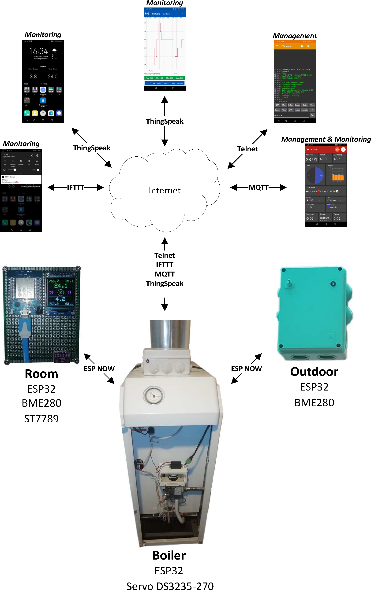

## ESP32 Boiler Control with gas valve 630 EUROSIT, ESP32 and servo drive

## Управление газовым котлом с клапаном 630 EUROSIT, с помощью ESP32 и сервопривода

### Поддержание заданной температуры в доме, управление и мониторинг с успользованием сервисов MQTT, ThingSpeak, IFTTT, Telnet Bluetooth, Telnet WiFi
### Сборка в Arduino IDE

* Функциональность
  * Измерение
  	* температуры, влажности, атмосферного давления в помещении
  	* температуры, влажности, атмосферного давления вне помещения
  	* температуры воды и температуры отходящих газов в котле
  * Вывод параметров
  	* на экран модуля, установленного в помещении
  	* на экран смартфона
  	* в облачную базу данных ThingSpeak, с возможностью видеть графики параметров
  * Управление, изменение настроек
	* по WiFi и Bluetooth каналам через Telnet подключение
	* через установленное в смартфоне прлиложение IoT MQTT Panel
  * Получение уведомлений
	* при изменении положения рукоятки газового клапана
	* при перезагрузке модулей
	

* Обмен информацией между модулями происходит по технологии ESP-NOW и не требует наличия Internet и работы WiFi роутера
* Температура в помещении поддерживается с точностью ±0,3°С

* При запуске экрана **IPS 1.3 inch 3.3V SPI ST7789 Drive IC 240х240**
   * использовал библиотеки https://github.com/adafruit/Adafruit-GFX-Library и https://github.com/adafruit/Adafruit-ST7735-Library последних версий
   * так как у модуля отсутствует вывод CS и для использования “своих” пинов потребовалось внести изменение в пример библиотеки Adafruit-ST7735-Library: 
   * `SPI.begin(TFT_SCLK, TFT_MISO, TFT_MOSI)`
   * tft.init(240, 240, `SPI_MODE3`)
      
* Таблица соединений

Датчик        | WEMOS D1 Mini ESP32
--------------|----------------------
SERVO_PIN     |IO16
SERVO_VCC     |IO17
DS18B20       |IO23
LED_RED       |IO26
LED_GREEN     |IO18
LED_BLUE      |IO19

TFT ST7789     	|WEMOS D1 Mini ESP32
----------------|--------------------------
GND             |GND
VCC             |+3.3V
SCL             |IO22 (Wire SCL)
SDA             |IO21 (Wire SDA)
RES             |IO5
DC              |IO23
BLK             |Не подключен

* Команды, используемые для проверки состояния или изменения настроек, передаваемые через WiFi и Bluetooth Telnet

Команда                  |Действие
-------------------------|------------------------------------------------------------------
Password                 |Ввод пароля, отключение введенного пароля
Login/[SSID]/[Password]  |Запись в память логина и пароля WiFi, ввод-вывод, String/String
Reconnect                |Переподключение WiFi по логину и паролю хранящимися в памяти
Reset                    |Перезагрузка
Count                    |Вывод счетчиков перезагрузок и реконнектов
CountRes                 |Сброс счетчиков перезагрузок и реконнектов
WiFi                     |Вывод текущих параметров WiFi
Scan                     |Сканирование каналов WiFi
Time                     |Вывод текущего времени
Mem                      |Вывод количества свободной памяти
OTA                      |Разрешение загрузки по воздуху
Notice 			 |Отключение уведомление 
HourDown/<0÷23> 	 |Установка часа подъема заданной температуры
HourUp/<0÷23>") 	 |Установка часа снижения заданной температуры
Cycle/<15|30|60> 	 |Установка времени цикла регулирования, мин.
Mode/<0÷3>		 |Установка режима: 0-ручной; 1-авто; 2-авто с изменением ±0,5°С; 3-авто с изменением ±1,0°С 
Posit/<1÷21>		 |Ручное позиционирование рукоятки клапана: x=P/4+0.75 (1<=x<=6)
SetTemp/<21.0÷25.0> 	 |Установка заданной температуры
Help                     |Вывод списка команд
?                        |Вывод списка команд
  
  
### Используемое ПО, с благодарностью к авторам
Приложение                | Ссылка
--------------------------|--------------------------
IoT MQTT Panel Pro        |https://play.google.com/store/apps/details?id=snr.lab.iotmqttpanel.prod.pro
Serial Bluetooth Terminal |https://play.google.com/store/apps/details?id=de.kai_morich.serial_bluetooth_terminal
IFTTT                     |https://play.google.com/store/apps/details?id=com.ifttt.ifttt)
ThingView Full            |https://play.google.com/store/apps/details?id=com.cinetica_tech.thingview.full

-------------------------------------------------------------------------------------------------------------------------------------
### Посмотреть на результат:
Сервис     | Ссылка
-----------|--------------------
ThingSpeak |https://thingspeak.com/channels/1160831
YouTube    |https://youtu.be/9PBNjdy-X4U
  
  
