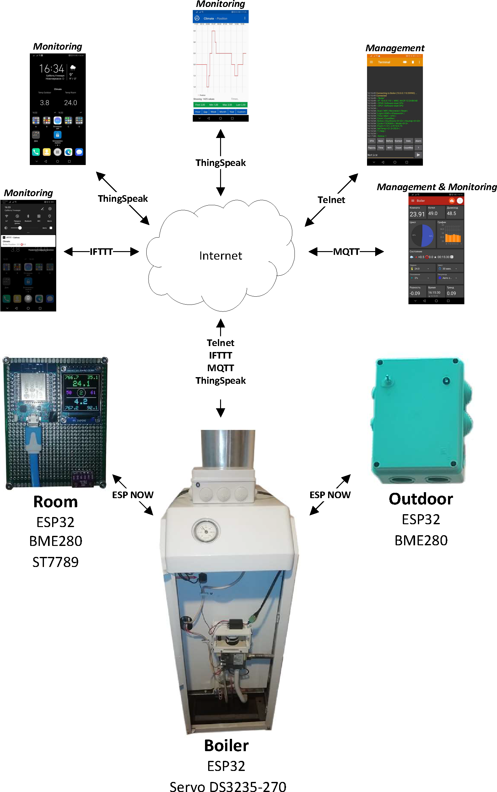

## ESP32 Boiler Control with gas valve 630 EUROSIT, ESP32 and servo drive

## Управление газовым котлом с клапаном 630 EUROSIT, с помощью ESP32 и сервопривода

### Поддержание заданной температуры в доме, управление и мониторинг с успользованием сервисов MQTT, ThingSpeak, IFTTT, Telnet Bluetooth, Telnet WiFi
### Сборка в Arduino IDE

* Функциональность
  * Измерение
    * температуры, влажности, атмосферного давления в помещении
    * температуры, влажности, атмосферного давления вне помещения
    * температуры воды и температуры отходящих газов в котле
    * 
  * Вывод параметров
    * на экран модуля, установленного в помещении
    * на экран смартфона
    * в облачную базу данных ThingSpeak, с возможностью видеть графики параметров
  * Управление, изменение настроек
	* по WiFi и Bluetooth каналам через Telnet подключение
	* через установленное в смартфоне прлиложение IoT MQTT Panel
	* регулирование мощности горелки котла вращением рукоятки газового клапана с помощью сервопривода
  * Получение уведомлений
    * при выполнении вращения рукоятки газового клапана
    * 

* При сборке 
  * При запуске 
    * 
    * 
    

  * При запуске экрана **IPS 1.3 inch 3.3V SPI ST7789 Drive IC 240х240**
    * использовал библиотеки https://github.com/adafruit/Adafruit-GFX-Library и https://github.com/adafruit/Adafruit-ST7735-Library последних версий
    * так как у модуля отсутствует вывод CS и для использования “своих” пинов потребовалось внести изменение в пример библиотеки Adafruit-ST7735-Library: 
      * `SPI.begin(TFT_SCLK, TFT_MISO, TFT_MOSI)`
      * tft.init(240, 240, `SPI_MODE3`)
      
* Таблица соединений

 123	|WEMOS D1 Mini ESP32
--------|--------------------------
        | 
        | 
        | 
        | 

TFT ST7789     	|WEMOS D1 Mini ESP32
----------------|--------------------------
GND             |GND
VCC             |+3.3V
SCL             |IO22 (Wire SCL)
SDA             |IO21 (Wire SDA)
RES             |IO5
DC              |IO23
BLK             |Не подключен

* Команды, используемые для проверки состояния или изменения настроек, передаваемые через WiFi и Bluetooth Telnet

Команда                  |Действие
-------------------------|------------------------------------------------------------------
Password                 |Ввод пароля, отключение введенного пароля
Login/[SSID]/[Password]  |Запись в память логина и пароля WiFi, ввод-вывод, String/String
Reconnect                |Переподключение WiFi по логину и паролю хранящимися в памяти
Reset                    |Перезагрузка
Count                    |Вывод счетчиков перезагрузок и реконнектов
CountRes                 |Сброс счетчиков перезагрузок и реконнектов
WiFi                     |Вывод текущих параметров WiFi
Scan                     |Сканирование каналов WiFi
Time                     |Вывод текущего времени
Mem                      |Вывод количества свободной памяти
OTA                      |Разрешение загрузки по воздуху

Help                     |Вывод списка команд
?                        |Вывод списка команд
  
  
  
### Используемое ПО, с благодарностью к авторам
Приложение                | Ссылка
--------------------------|--------------------------
IoT MQTT Panel Pro        |https://play.google.com/store/apps/details?id=snr.lab.iotmqttpanel.prod.pro
Serial Bluetooth Terminal |https://play.google.com/store/apps/details?id=de.kai_morich.serial_bluetooth_terminal
IFTTT                     |https://play.google.com/store/apps/details?id=com.ifttt.ifttt)
ThingView Full            |https://play.google.com/store/apps/details?id=com.cinetica_tech.thingview.full

-------------------------------------------------------------------------------------------------------------------------------------
### Посмотреть на результат:
Сервис     | Ссылка
-----------|--------------------
ThingSpeak |
YouTube    |
  
  
